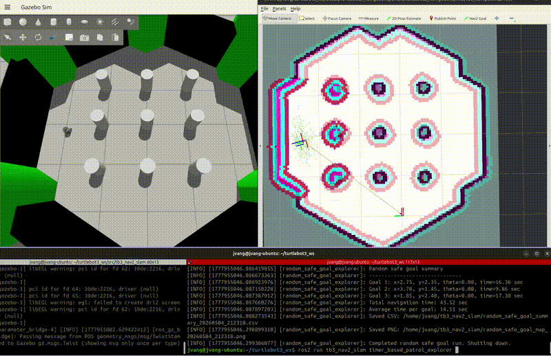
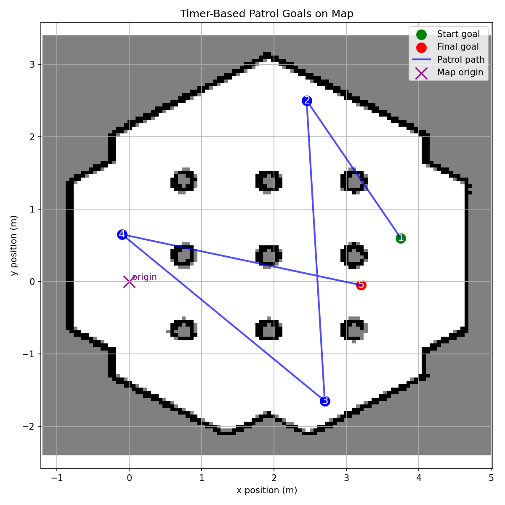
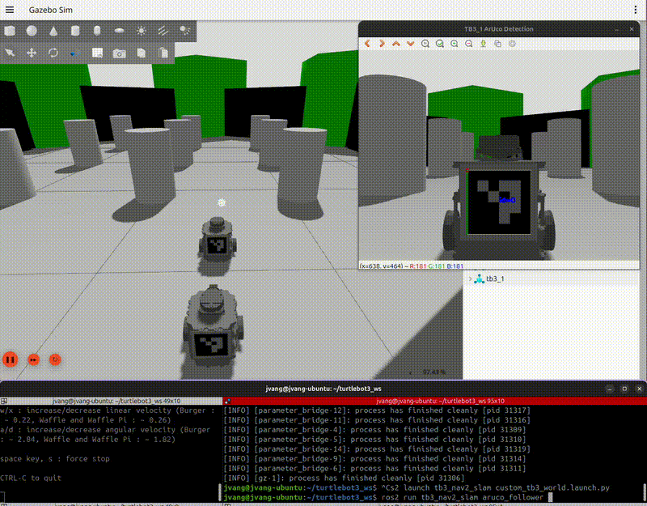
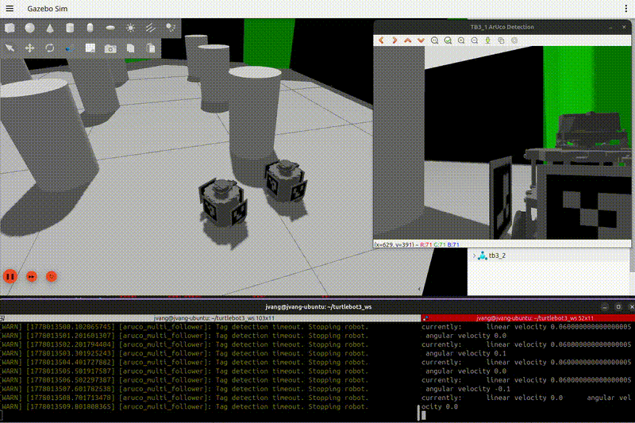
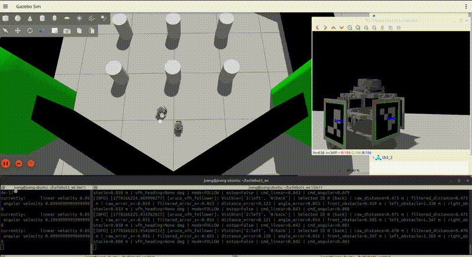

# tb3_nav2_slam

ROS 2 package for TurtleBot3 navigation, SLAM, goal exploration, robot following, and ArUco-based robot detection experiments in Gazebo and on TurtleBot3 hardware.

This project is currently used as a hands-on mobile robotics testbed for learning and validating Nav2, SLAM, multi-robot simulation, robot following behavior, and perception-based tracking.

---

## Current Status

The package currently includes working scripts and launch files for:

- TurtleBot3 Nav2 goal navigation
- Single-goal navigation and return behavior
- Navigation through a list of goals
- Random safe goal exploration
- Timer-based patrol exploration
- LiDAR-based robot following
- ArUco-based robot following using RGB camera and pose estimation
- Multi-ArUco robot following with multiple tags around the target robot
- Upgraded ArUco multi-follower with EMA smoothing, proportional control, LiDAR emergency stop, avoidance, and recovery backup behavior
- VFH-style ArUco multi-follower for smoother obstacle-aware following
- Two TurtleBot3 simulation setup in Gazebo
- Custom TurtleBot3 world launch support
- Gazebo simulation support for robot-to-robot detection experiments

---

## Featured Work

### Timer-Based Patrol Explorer

The `timer_based_patrol_explorer` node performs autonomous exploration by sending navigation goals at timed intervals.

<p align="center">
  
</p>

<p align="center">
  
</p>

This node:
- Dispatches goals at fixed time intervals instead of purely random sampling
- Uses Nav2 for path planning and execution
- Generates a map showing visited goals and path coverage
- Saves results with timestamps for repeatable testing

Behavior characteristics:
- Goals are selected periodically to ensure continuous movement
- Navigation success/failure is monitored
- Exploration coverage can be visually validated through saved output maps

Safety considerations:
- Relies on Nav2 costmaps to avoid obstacles
- Avoids sending invalid or unreachable goals
- Stops or retries when navigation fails
- Maintains stable motion through Nav2 constraints

#### How to Run

Terminal 1:
```bash
ros2 launch turtlebot3_gazebo turtlebot3_world.launch.py
```

Terminal 2:
```bash
ros2 launch turtlebot3_navigation2 navigation2.launch.py map:=$HOME/map_turtlebot3_world.yaml use_sim_time:=true
```

Terminal 3:
```bash
ros2 run tb3_nav2_slam timer_based_patrol_explorer.py
```

---

### ArUco-Based Robot Following

This project demonstrates vision-based robot-to-robot tracking using ArUco markers and an RGB camera.

<p align="center">
  
</p>

System pipeline:

```text
Camera -> ArUco Detection -> Pose Estimation -> Pose Topic -> Follower Controller -> cmd_vel
```

System behavior:
- Two TurtleBot3 robots are spawned in Gazebo
- The target robot (tb3_2) is teleoperated
- The follower robot (tb3_1) uses its camera to detect ArUco markers
- The pose of the detected marker is estimated using OpenCV
- Pose is converted into a robot-friendly coordinate system
- A follower node generates velocity commands based on:
  - Forward distance to the target
  - Lateral offset from the center of the image

Control characteristics:
- Moves forward when the target is far
- Rotates toward the target when off-center
- Stops at a defined distance threshold
- Stops automatically if the marker is lost

#### How to Run

Terminal 1:
```bash
ros2 launch tb3_nav2_slam custom_tb3_world.launch.py
```

Terminal 2:
```bash
ros2 run turtlebot3_teleop teleop_keyboard --ros-args -r cmd_vel:=/tb3_2/cmd_vel
```

Terminal 3:
```bash
ros2 run tb3_nav2_slam aruco_detector
```

Terminal 4:
```bash
ros2 run tb3_nav2_slam aruco_pose_tracker
```

Terminal 5:
```bash
ros2 run tb3_nav2_slam aruco_follower
```

---

## Multi-ArUco Robot Following

<p align="center">
  
</p>

This feature extends the original ArUco pipeline to support **multiple markers and 360° tracking**.

The original ArUco follower tracked one marker at a time. That worked when the target robot was directly visible, but tracking became less stable when the target rotated, partially blocked the marker, or exposed a different side of the robot.

The multi-marker version adds ArUco tags around the target robot so the follower can continue tracking from more angles.

### System Pipeline

```text
Camera -> Multi Detector -> Detection Topic -> Multi Follower -> cmd_vel
```

### Marker Layout

0 = back  
1 = front  
2 = left  
3 = right  

### Multi-Detector Logic

- Subscribes to: `/tb3_1/camera/image`
- Detects all visible markers
- Estimates pose using OpenCV
- Publishes structured detection data
- Supports multiple tag IDs in the same camera frame
- Adds marker-side labels so the follower can reason about which robot side is visible
- Includes marker-facing filtering to reduce backside detections from Gazebo rendering

### Multi-Follower Logic

Instead of selecting the closest tag, the system uses priority:

1. back tag  
2. left/right tags  
3. front tag  

This allows:
- stable tracking when multiple tags are visible
- smooth transitions during robot rotation
- more realistic robot-to-robot following behavior
- better tracking continuity than the original single-tag follower

### Handling Multiple Visible Tags

When multiple tags are detected:
- system selects the best candidate based on alignment and priority
- avoids rapid switching between tags
- maintains smoother motion control
- continues tracking even when the target robot turns and exposes a different marker

---

## How to Run (Multi-ArUco)

Terminal 1:
```bash
ros2 launch tb3_nav2_slam custom_tb3_world.launch.py
```

Terminal 2:
```bash
ros2 run turtlebot3_teleop teleop_keyboard --ros-args -r cmd_vel:=/tb3_2/cmd_vel
```

Terminal 3:
```bash
ros2 run tb3_nav2_slam aruco_multi_detector
```

Terminal 4:
```bash
ros2 run tb3_nav2_slam aruco_multi_follower
```

Terminal 5 (only used to see camera view):
```bash
ros2 run tb3_nav2_slam aruco_detector 
```

---

## Improvements Made with Upgraded Version

The `aruco_upgraded_multi_follower` node builds on the original `aruco_multi_follower` by adding smoother control and local obstacle safety.

The original multi-follower focused mainly on selecting and following the best visible ArUco tag. The upgraded version improves the control layer after tag selection.

### Main Improvements

- **EMA smoothing**
  - Smooths noisy ArUco distance and horizontal error readings
  - Reduces twitchy movement caused by small camera pose jumps
  - Resets when a different tag is selected or when tracking is lost

- **Proportional distance and angle control**
  - Converts target distance error into forward velocity
  - Converts image-center error into turning velocity
  - Keeps the robot response proportional to how far it is from the target alignment

- **LiDAR emergency stop**
  - Subscribes to `/tb3_1/scan`
  - Checks the front LiDAR sector for close obstacles
  - Blocks motion when an obstacle is inside the emergency stop distance

- **Left/right obstacle avoidance**
  - Splits LiDAR into front, left, and right regions
  - Chooses a turn direction based on which side has more clearance
  - Allows the robot to react to poles or walls instead of only following the ArUco tag

- **Recovery backup behavior**
  - Adds a reverse-and-turn behavior when the robot gets too close to an obstacle
  - Helps the robot recover instead of staying stuck in an emergency stop
  - Uses side clearance to decide whether to back up left or right

### Why These Changes Were Made

These upgrades were added because the original multi-follower could follow a target but did not handle obstacles well. In simulation, the robot could continue toward a pole if the ArUco target was still visible. The upgraded follower adds LiDAR-based safety and recovery behavior so the robot can react when the path to the target is blocked.

The upgraded version also improved motion quality. Camera-based ArUco pose estimates can jump between frames, so EMA smoothing was added to make the robot follow more consistently.

### How to Run Upgraded Multi-Follower

Terminal 1:
```bash
ros2 launch tb3_nav2_slam custom_tb3_world.launch.py
```

Terminal 2:
```bash
ros2 run turtlebot3_teleop teleop_keyboard --ros-args -r cmd_vel:=/tb3_2/cmd_vel
```

Terminal 3:
```bash
ros2 run tb3_nav2_slam aruco_multi_detector
```

Terminal 4:
```bash
ros2 run tb3_nav2_slam aruco_upgraded_multi_follower \
  --ros-args \
  -p avoidance_distance:=0.25 \
  -p emergency_stop_distance:=0.138 \
  -p front_angle_deg:=30.0 \
  -p avoidance_turn_speed:=0.18 \
  -p avoidance_linear_speed:=0.00 \
  -p enable_recovery_backup:=True \
  -p recovery_backup_speed:=-0.03 \
  -p recovery_turn_speed:=0.20
```

Terminal 5 (only used to see camera view):
```bash
ros2 run tb3_nav2_slam aruco_front_detector_only 
```

---

## VFH ArUco Multi-Follower

<p align="center">
  
</p>

This version upgrades the previous multi-follower using a lightweight VFH-style obstacle avoidance system.

### VFH Improvements

Instead of only deciding between left or right, the robot:
- divides the LiDAR scan into multiple angle sectors
- measures obstacle clearance in each sector
- selects the safest direction closest to the target robot
- generates smoother steering around obstacles

This resulted in:
- smoother pathing around poles
- reduced oscillation
- more natural steering behavior
- improved robot-to-robot tracking continuity
- better obstacle recovery during close encounters

### Additional Behaviors

The VFH follower also includes:
- EMA smoothing for ArUco pose estimation
- proportional distance and heading control
- LiDAR emergency stop logic
- recovery backup behavior
- multi-marker tracking support
- backside marker rejection filtering

### How to Run

Terminal 1:
```bash
ros2 launch tb3_nav2_slam custom_tb3_world.launch.py
```

Terminal 2:
```bash
ros2 run turtlebot3_teleop teleop_keyboard --ros-args -r cmd_vel:=/tb3_2/cmd_vel
```

Terminal 3:
```bash
ros2 run tb3_nav2_slam aruco_multi_detector
```

Terminal 4:
```bash
ros2 run tb3_nav2_slam aruco_vfh_follower \
  --ros-args \
  -p avoidance_distance:=0.25 \
  -p emergency_stop_distance:=0.18 \
  -p front_angle_deg:=30.0 \
  -p avoidance_linear_speed:=0.02 \
  -p vfh_sector_deg:=10.0 \
  -p vfh_angle_limit_deg:=90.0 \
  -p vfh_clearance_distance:=0.35 \
  -p vfh_turn_gain:=1.25 \
  -p enable_recovery_backup:=True \
  -p recovery_backup_speed:=-0.03 \
  -p recovery_turn_speed:=0.20
```
Terminal 5 (only used to see camera view):
```bash
ros2 run tb3_nav2_slam aruco_front_detector_only 
```

---

## Repository Structure

```text
tb3_nav2_slam/
├── launch/
│   ├── custom_tb3_world.launch.py
│   ├── lidar_following_robot.launch.py
│   ├── lidar_following_robot_sim.launch.py
│   ├── spawn_tb3_1_with_bridge.launch.py
│   ├── tb3_1_bridge.launch.py
│   └── two_tb3_sim.launch.py
├── models/
├── scripts/
├── tb3_nav2_slam/
│   ├── aruco_detector.py
│   ├── aruco_front_detector_only.py
│   ├── aruco_pose_tracker.py
│   ├── aruco_follower.py
│   ├── aruco_multi_detector.py
│   ├── aruco_multi_follower.py
│   ├── aruco_upgraded_multi_follower.py
│   ├── aruco_vfh_follower.py
│   ├── goal_from_list.py
│   ├── lidar_following_robot.py
│   ├── random_safe_goal_explorer.py
│   ├── single_goal_nav.py
│   ├── single_goal_return.py
│   └── timer_based_patrol_explorer.py
├── img/
├── package.xml
├── setup.py
└── LICENSE
```

---

## Main ROS 2 Nodes

| Node | Purpose |
|---|---|
| `single_goal_nav` | Sends one Nav2 goal to the robot |
| `single_goal_return` | Sends a goal and returns from that goal |
| `goal_from_list` | Runs navigation goals from a predefined list |
| `random_safe_goal_explorer` | Selects safe random goals for exploration testing |
| `timer_based_patrol_explorer` | Runs patrol/exploration behavior for a timed session |
| `lidar_following_robot` | Uses LiDAR scan data for basic following behavior |
| `aruco_detector` | Detects ArUco markers from camera input |
| `aruco_front_detector_only` | Tests ArUco detection with marker-facing filtering |
| `aruco_pose_tracker` | Estimates marker pose and publishes target position |
| `aruco_follower` | Follows target robot using pose-based control |
| `aruco_multi_detector` | Detects multiple ArUco tags and publishes structured detection data |
| `aruco_multi_follower` | Follows the target robot using multi-tag priority logic |
| `aruco_upgraded_multi_follower` | Adds EMA smoothing, proportional control, LiDAR safety, avoidance, and recovery backup |
| `aruco_vfh_follower` | Uses VFH-style LiDAR sector steering for smoother obstacle-aware following |

---

## Build Instructions

```bash
cd ~/turtlebot3_ws
colcon build --packages-select tb3_nav2_slam --symlink-install
source install/setup.bash
```

---

## Example Commands

### Launch TurtleBot3 Gazebo World

```bash
ros2 launch tb3_nav2_slam custom_tb3_world.launch.py
```

### Launch Two TurtleBot3 Robots in Simulation

```bash
ros2 launch tb3_nav2_slam two_tb3_sim.launch.py
```

### Run Timer-Based Patrol Explorer

```bash
ros2 run tb3_nav2_slam timer_based_patrol_explorer
```

### Run ArUco Detection and Following

```bash
ros2 run tb3_nav2_slam aruco_detector
ros2 run tb3_nav2_slam aruco_pose_tracker
ros2 run tb3_nav2_slam aruco_follower
```

### Run Multi-ArUco Following

```bash
ros2 run tb3_nav2_slam aruco_multi_detector
ros2 run tb3_nav2_slam aruco_multi_follower
```

### Run Upgraded Multi-ArUco Following

```bash
ros2 run tb3_nav2_slam aruco_multi_detector
ros2 run tb3_nav2_slam aruco_upgraded_multi_follower
```

### Run VFH ArUco Following

```bash
ros2 run tb3_nav2_slam aruco_multi_detector
ros2 run tb3_nav2_slam aruco_vfh_follower
```

---

## Current Working Features

- ROS 2 Python package builds successfully with `ament_python`
- Nav2 goal scripts are installed as ROS 2 console commands
- Gazebo simulation launch files are included
- Two-robot simulation setup is included
- Timer-based patrol exploration with result visualization
- ArUco-based detection, pose estimation, and robot following
- Multi-ArUco detection and multi-tag robot following
- Marker-facing filtering to reduce backside ArUco detections
- EMA-smoothed ArUco following control
- LiDAR emergency stop behavior
- LiDAR-based left/right avoidance behavior
- Recovery backup behavior for close obstacle situations
- VFH-style LiDAR sector steering for obstacle-aware following
- MIT license is included

---

## Work in Progress

- Further tuning VFH parameters for smoother behavior in cluttered Gazebo worlds
- Reducing oscillation during close obstacle following scenarios
- Improving transition logic between following, avoiding, and recovery behaviors
- Expanding testing on physical TurtleBot3 hardware
- Improving documentation with additional visuals and diagrams

---

## Notes

This project is experimental and actively being developed. It is intended for learning, testing, and documenting applied mobile robotics workflows using TurtleBot3, ROS 2, Nav2, SLAM, Gazebo, LiDAR, and camera-based perception.

---

## License

MIT License